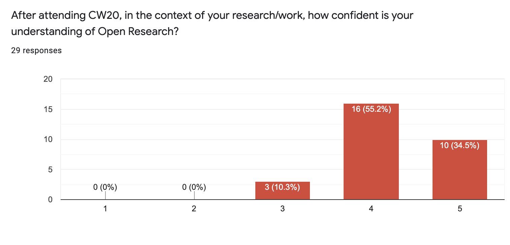
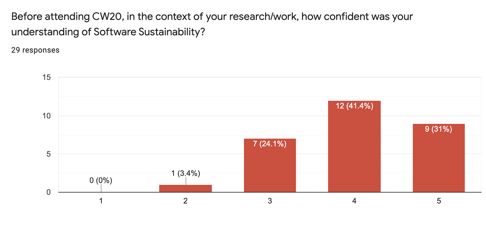

.. _CW20-Outputs-and-Outcomes-Plan: 

CW20 Outputs and Outcomes Plan
===============================

Outputs
--------------------

- Presentations

    - From keynotes (`slides <https://cw20.figshare.com/>`_, `videos <https://www.youtube.com/playlist?list=PLpX1jXuNTXGrAZr9I-jo0TNYNpfa5gpji>`_)
    - From lightning talks  (`slides <https://cw20.figshare.com/>`_, `videos <https://www.youtube.com/playlist?list=PLpX1jXuNTXGqsMGvMAQQSpCCpbwu1Th7a>`_)
    - From mini-workshops and demo sessions (`videos <https://www.youtube.com/playlist?list=PLpX1jXuNTXGqYOz7idfOVp6KfBTrjWlWS>`_)

- `Speed blog posts <https://software.ac.uk/tags/cw20-speed-blog-posts>`_ from the discussion sessions
- `Collaborative Ideas <https://software.ac.uk/cw20/collaborative-ideas-group>`_
- Hack Day

    - `Information about entries and winners <https://software.ac.uk/cw20/hackday-entries-and-winners>`_
    - `Presentations <https://www.youtube.com/playlist?list=PLpX1jXuNTXGpBBfpZ93Uwas7FimQC2l1H>`_

- `Infrastructure resources <https://doi.org/10.6084/m9.figshare.c.5026400>`_
- `Blog posts <https://software.ac.uk/tags/collaborations-workshop-2020>`_

Outcomes
--------------------

As part of our post-event feedback survey, we asked participants how confident their understanding was of each of the CW20 themes in the context of their research/work, both before and after the event. 
In general, participants were more confident about their understanding of Open Research, Data Privacy and Software Sustainability after attending CW20.

.. figure:: ../img/CW20_OpenResearchBefore.png
  :alt: CW20 feedback

.. figure:: ../img/CW20_DataPrivacyBefore.png
  :alt: CW20 feedback

.. figure:: ../img/CW20_DataPrivacyAfter.png
  :alt: CW20 feedback

.. figure:: ../img/CW20_SoftwareSustainabilityAfter.png
  :alt: CW20 feedback

As CW20 took place online relatively early on in the pandemic, it had an impact on virtual events run by others, and the Institute was often consulted regarding the use of Zoom.

