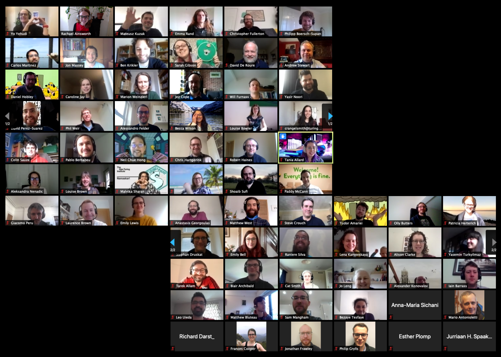

.. _CW20:

.. Comment - `Link text <https://domain.invalid/>`_

Collaborations Workshop 2020 (CW20) - Online 
=============================================

Case study author: Rachael Ainsworth (`ORCID <http://orcid.org/0000-0003-2591-9462>`__)

The Collaborations Workshop (CW) is the annual flagship event of the Software Sustainability Institute. It brings together researchers, developers, innovators, managers, funders, publishers, leaders, and educators to explore and share best practice.

On 5 March - just over three weeks before `Collaborations Workshop 2020 (CW20) <https://software.ac.uk/cw20>`_ was due to start in Belfast, Northern Ireland - everything was in place. The programme had been finalised, keynote speakers announced, catering booked and accommodation assigned. There had been some issues - a group from Northern Italy had cancelled because they had been quarantined due to an outbreak of a novel coronavirus. At this point the number of reported cases in the UK was small, but things were moving rapidly. The clear message was that we couldn’t run the event as planned. 

CW is a highly interactive event with around 80-100 participants, and is designed to facilitate meeting as many new people as possible. With a global pandemic forcing us to stay at home, could we successfully recreate the experience online, and with only three weeks to prepare? Given the amount of work that had already been put into organising the event, the decision was made on 10 March to move the event online and stick with the original dates: 31 March - 2 April.

Here is how we did it.

.. toctree::
   :maxdepth: 1
   :caption: Sections:

   case-studies-cw20-infrastructure
   case-studies-cw20-timeline
   case-studies-cw20-budget
   case-studies-cw20-committees
   case-studies-cw20-agenda
   case-studies-cw20-publicity
   case-studies-cw20-sponsorship
   case-studies-cw20-venue
   case-studies-cw20-catering 
   case-studies-cw20-event-roles
   case-studies-cw20-risk-management
   case-studies-cw20-outputs-and-outcomes-plan 
   case-studies-cw20-closing-down

   

