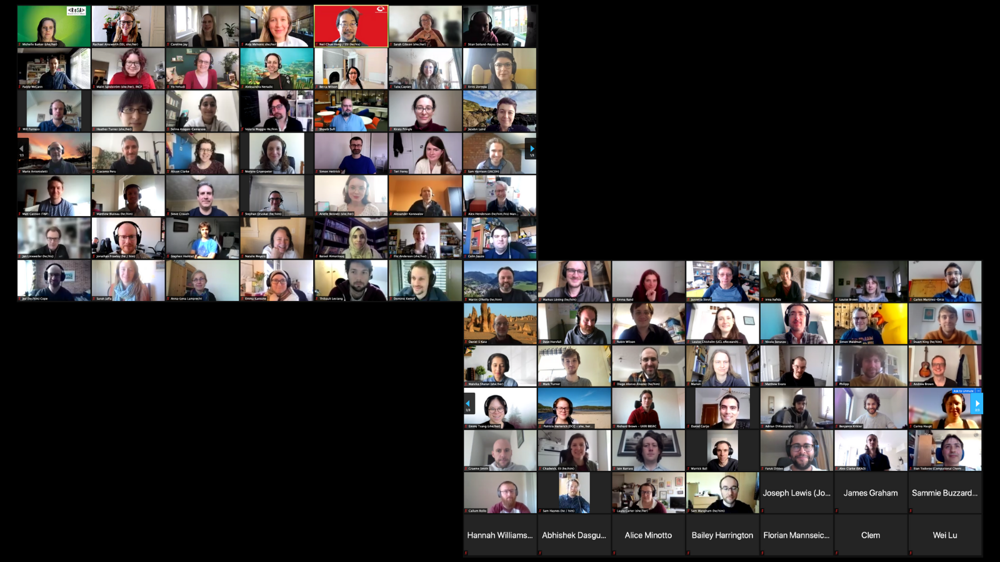

.. _cw21:

.. Comment - `Link text <https://domain.invalid/>`_

Collaborations Workshop 2021 (CW21) - Online 
=============================================

In Practice authors: Rachael Ainsworth (`ORCID <http://orcid.org/0000-0003-2591-9462>`__) and Shoaib Sufi (`ORCID <https://orcid.org/0000-0001-6390-2616>`__)

The Collaborations Workshop (CW) is the annual flagship event of the `Software Sustainability Institute <www.software.ac.uk>`_. It brings together researchers, developers, innovators, managers, funders, publishers, leaders, and educators to explore and share best practice. 

.. toctree::
   :maxdepth: 2
   :caption: Sections:

   feasibility-stage/feasibility-stage
   event-project-stage/event-project-stage
