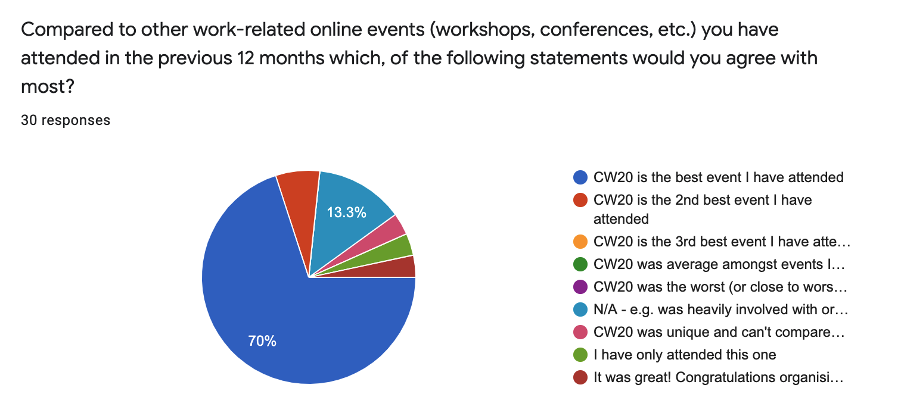
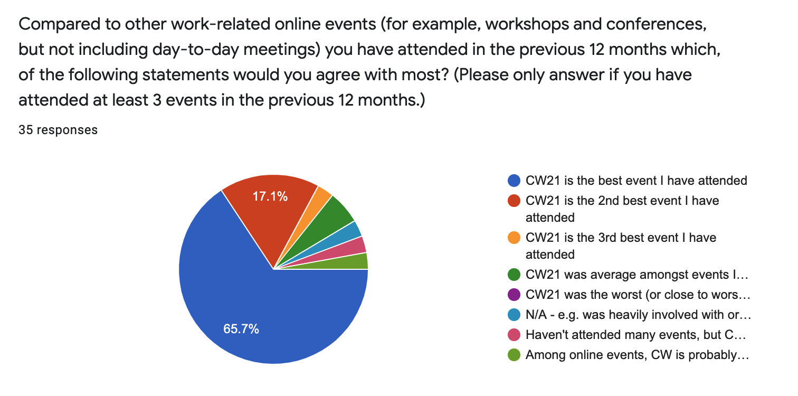
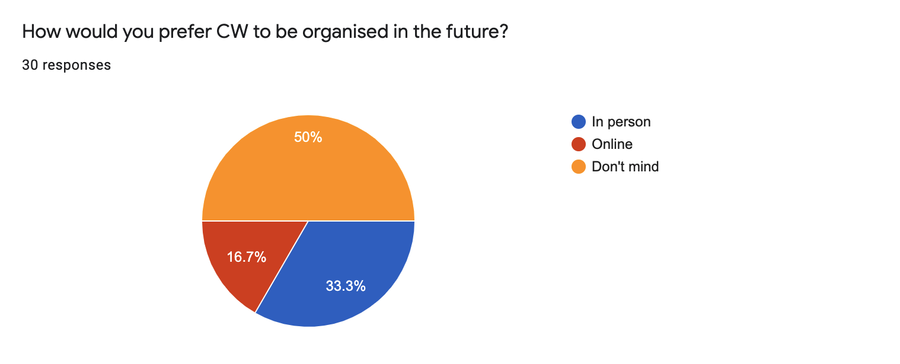
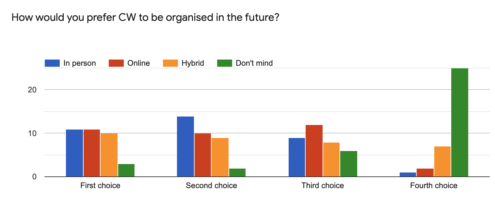

.. _cw21-eps-risk-management: 

CW21 Risk Management  
=====================

For CW21, we looked at the following risk aspects:

- The main stakeholder and funder (the Software Sustainability Institute)
- Other stakeholders (sponsors, keynote speakers, attendees, session chairs, organising committee members, volunteers/helpers at the event)
- Event agenda
- Venue
- Communication (with various stakeholders)
- Policies, guidelines and documentation 

Unlike for :ref:`CW20 <CW20-Risk-Management>`, the global pandemic was at the forefront of our risk assessment and mitigation plan for CW21. 
We decided from the beginning that CW21 would take place online for two main reasons:

1. It was clear that the pandemic would be ongoing and there would still be hesitancy from both organisers and participants towards traveling to an in-person event.
2. It was an opportunity to improve and build off of what we achieved running :ref:`CW20 Online <In-Practice-CW20>`.

It turned out that there were still many restrictions around international travel and in-person events at the time of CW21, so we successfully mitigated the risk of having to cancel another in-person event. 

The main stakeholder
--------------------

The risks that we identified and needed to mitigate relating to the main stakeholder - in this case the Software Sustainability Institute - were:

- Event goals and objectives not aligned with the main stakeholder goals
- Damage to the main stakeholder’s reputation

As we demonstrated through CW20, the event goals and objectives can be achieved through a virtual event.
To ensure that the :ref:`cw21-fs-goals-and-objectives` aligned with the main stakeholder goals, the Director was consulted during the :ref:`cw21-feasibility-stage`, and both the Director and Research Director were invited to participate on the :ref:`CW21 Steering Committee <cw21-eps-committees>`.

Running CW20 virtually at the start of the pandemic led to the Institute being internationally recognised and regularly consulted on virtual event organisation and community building. 
70% of CW20 participants who gave feedback stated that "CW20 is the best [online] event I have attended".

  
  Feedback from CW20 participants on how the event compared with other online events

Due to the attention and care that we put into improving and building off of what we achieved during CW20, we had similar feedback after CW21 when compared with the past year of virtual events. 

  
  Feedback from CW21 participants on how the event compared with other online events

Other stakeholders 
--------------------

Attendees
^^^^^^^^^^^^

The risks identified regarding the attendees include:

- Not enough attendees or many dropping out right before the event
- Too many attendees

The strategy we took to mitigate these risks included:

- Keep a registration fee in place for a virtual event to minimise no-shows
- Limit the number of registrations to 150 so that we could manage the interactive sessions and have a more intimate event

Within the CW20 feedback form, we asked participants how they would prefer us to organise CW in the future (in-person or online).
Half of respondents said that they didn't mind how it was run, and 33% said that they prefer an in-person event.

  
  Feedback from CW20 participants on how to organise the event in the future 

However, as the effects of the pandemic were ongoing, we decided that CW21 would take place online.
As the vaccination programmes advance and things begin to open up, there is pressure and expectation for hybrid events. 
We asked CW21 on the feedback form to rank how they prefer future CWs to be organised: in-person, online, hybrid or don't mind, the results of which are displayed below:

  
  Feedback from CW21 participants on how to organise the event in the future

Opinions were more or less evenly split between the different options, and we believe this may be due to ongoing uncertainty about the pandemic.

Keynote speakers
^^^^^^^^^^^^^^^^

Risks that we identified from running CW20 online included sickness or being unable to present due to caring or other responsibilities imposed based on restrictions due to the pandemic.
Connection or technical issues could also arise.
The strategy we took to mitigate these risks was to request the keynote speakers to pre-record their presentations. 
We provided a speaker guide with guidance and advice for recording their talk, and our full support with editing and captioning the videos. 

This strategy had the added benefit that it allowed us to have keynote speakers from regions with time zones incompatible with the times of the event - the speakers did not have to present outside of their normal working hours. 

Session chairs
^^^^^^^^^^^^^^^

The risks identified regarding the session chairs included connection or other technical issues. 
We also identified sickness or being unable to present due to caring or other responsibilities imposed based on restrictions due to the pandemic as risks from running CW20 online.
The strategy we took to mitigate these risks was to have backups for every :ref:`CW21 Event Role <cw21-eps-event-roles>` .

Organising Committee members
^^^^^^^^^^^^^^^^^^^^^^^^^^^^^

The risks identified regarding the Organising Committee members and the strategy we took to mitigate these risks were the same as during :ref:`CW20 <CW20-Risk-Management>`.
In particular, the largest risk was members being unable to help run the event on the day due to connection issues, schedules, sickness or being unable to present due to caring or other responsibilities imposed based on restrictions due to the pandemic.
Our mitigation strategy to have backups for every :ref:`CW21 Event Role <cw21-eps-event-roles>` still applies to these scenarios.

Volunteers/helpers at the event
^^^^^^^^^^^^^^^^^^^^^^^^^^^^^^^
The risks identified regarding volunteers and helpers at the event and the strategy we took to mitigate these risks were the same as during :ref:`CW20 <CW20-Risk-Management>`.

Event agenda
--------------------

The risks identified regarding the agenda included:

- The social activities are not attended or unsuccessful
- The days are too long for an online event leading to Zoom fatigue
- Some sessions don't translate well to an online setting
- Lose nascent quality of unconference event
- Technical issues
- Bus factor

The strategy we took to mitigate these risks included:

- Have a variety of sessions to keep participants engaged
- Schedule sufficient breaks throughout the day 
- Provide time for networking within the main programme to encourage networking between participants  
- Allowing participants to choose their own breakout rooms and have edit access to the collaborative documents improved nascent quality of virtual unconference
- Documenting procedure for running a session in case the Session Chair is unable to facilitate the session 

Venue 
--------------------

One risk to using Zoom was that participants may be bored of Zoom and looking for new and exciting alternative platforms. 
However, we had the most experience with it and it had the best performance, scalability and functionality out of the many platforms we tested.
We attended many of the `CSCCE Tools Trials <https://www.cscce.org/category/cscce-cop/tools-trials/>`_ which tested and compared features from a variety of virtual conferencing platforms, including for `QuiqoChat <https://qiqochat.com/about>`_, `Etherpad with video <https://video.etherpad.com/>`_ and `Wonder <https://www.wonder.me/>`_, and found that Zoom still best met our needs.
The ability to create and manage breakout rooms is essential for our interactive sessions such as the Discussion session, Collaborative Ideas session and Hack Day.
The `added functionality in Zoom allowing participants to self-select their own breakout rooms <https://blog.zoom.us/using-zoom-breakout-rooms/>`_ was a game changer (we did not have this for CW20) and provided more autonomy for participants.
To provide variety to participants, we used alternative platforms for the social programme activities. 

Communication
--------------------

The risks identified regarding communication included:

- Participants confused about the agenda or not getting information on the right channels and at the appropriate time/frequency
- Too many or not enough pathways to engagement 

The strategy we took to mitigate these risks included:

- Emails to registrants communicating information regarding connection details, programme, and general guidance for getting the most out of the virtual event 
- Documentation for the delivery team (comprised of Session Chairs, the Organising Committee and volunteers/helpers), such as Zoom instructions for hosts, a duties roster, etc. to make sure that everyone was on the same page and knew their responsibilities
- Documented all relevant instructions, links and other information in the participant-facing collaborative notes document to keep everyone synchronised
- Slack workspace for the event that would persist outside of the Zoom meeting for sharing information and participant engagement
- Use of Sli.do to provide an interactive element for participants and an anonymous way of asking questions 

Policies, guidelines and documentation
---------------------------------------

The risks identified regarding policies, guidelines and documentation included:

- Lack of clearly stated policies and guidelines suitable for an online event 
- Data privacy issues related to using Zoom and risk of "Zoom-bombing"
- Data privacy issues related to which documents could be shared and how 
- Risk of connection details (such as the links to Zoom rooms, collaborative notes documents, transcriptions, and Slack channel) being shared publicly 
- Issues relating to Intellectual Property

The strategy we took to mitigate these risks included:

- Develop a set of `Participation Guidelines <https://software.ac.uk/cw21/participation-guidelines>`_ for the online event comprised of a Code of Conduct, Privacy Policy, Social Media Policy, Intellectual Property Policy and Change Log (to note any updates to the guidelines leading up to the event)

   - A lesson learned from CW20 was to update the Privacy Policy and add a license to the collaborative documents to enable easier sharing of outputs after the event 

- Disclaimer and license added to all collaborative documents generated so that participants would know how they could be used going forward and decide what information they were willing to share 
- Remind participants about the Participation Guidelines at the start of each day
- Remind participants not to publicly share any of the Zoom room links or collaborative documents which contain links to the Zoom rooms and Slack channel

