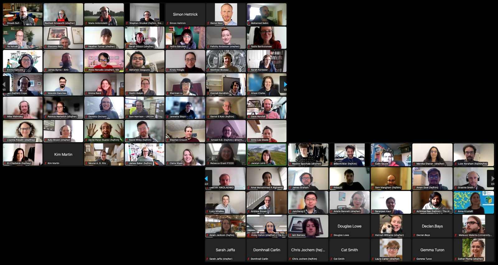

.. _in-practice-cw22:

.. Comment - `Link text <https://domain.invalid/>`_

Collaborations Workshop 2022 (CW22) - Online
=============================================

In Practice authors: Rachael Ainsworth (`ORCID <http://orcid.org/0000-0003-2591-9462>`__)

The Collaborations Workshop (CW) is the annual flagship event of the `Software Sustainability Institute <www.software.ac.uk>`_.
It brings together researchers, developers, innovators, managers, funders, publishers, leaders, and educators with a focus on research software to explore and share best practice.

We initially planned for the `Collaborations Workshop 2022 (CW22) <https://software.ac.uk/cw22>`_ to take place as a hybrid event, however there was still too much uncertainty and risk for an in-person element due to the ongoing COVID-19 pandemic.
Running CW online for a third time would also allow us to reuse and refine what we developed to run :ref:`CW21 Online <In-Practice-CW21>`..

Here is how we did it.
This In Practice write up includes how we organised CW22 Online where it differed from how we organised :ref:`CW21 Online <In-Practice-CW21>`., following the steps in the Feasibility Stage and the Event Project Stage of the main Event Organisation Guide.
Alternatively, if you would like to read about what happened at CW22, that can be found in this `CW22 Highlights <https://software.ac.uk/blog/2022-04-28-highlights-collaborations-workshop-2022>`_ blog post.

.. toctree::
   :maxdepth: 2
   :caption: Sections:

   feasibility-stage/feasibility-stage
   event-project-stage/event-project-stage
