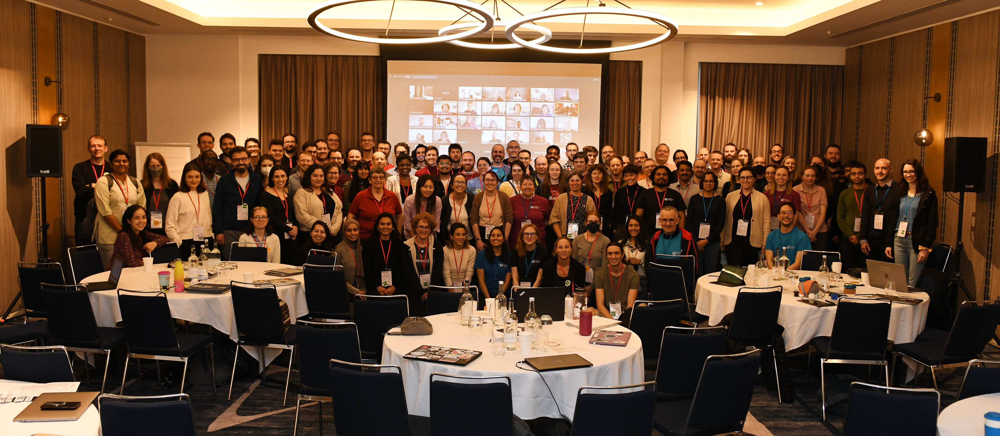
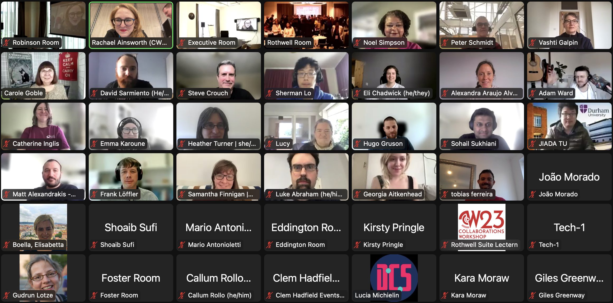

.. _in-practice-cw23:

.. Comment - `Link text <https://domain.invalid/>`_

Collaborations Workshop 2023 (CW23) - Hybrid
=============================================

In Practice authors: Rachael Ainsworth (`ORCID <http://orcid.org/0000-0003-2591-9462>`__)

The Collaborations Workshop (CW) is the annual flagship event of the `Software Sustainability Institute <www.software.ac.uk>`_. It brings together researchers, developers, innovators, managers, funders, publishers, leaders, and educators with a focus on research software to explore and share best practice.

We made the decision from the beginning that the `Collaborations Workshop 2023 (CW23) <https://software.ac.uk/cw23>`_ would take place as a hybrid event for three main reasons:

1. After three years of virtual CWs, our community was eager to meet in person.
2. Maintain accessibility of the event to people who were unable to attend in person.
3. Innovate and trial within the hybrid event space to provide guidance and advice on running hybrid events to our community.

Here is how we did it.
This In Practice write up covers how we organised CW23, following the steps in the Feasibility Stage and the Event Project Stage of the main Event Organisation Guide.

.. toctree::
   :maxdepth: 2
   :caption: Sections:

   feasibility-stage/feasibility-stage
   event-project-stage/event-project-stage
