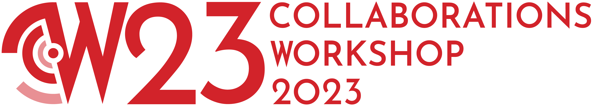

.. _cw23-eps-publicity:

CW23 Publicity
===============

Before the event
--------------------

To promote the event we selected a freely-usable image of a fairground from `Unsplash <https://unsplash.com/>`_ representing growth:

  Photo by `Arnaud Mesureur <https://unsplash.com/@tbzr?utm_source=unsplash&utm_medium=referral&utm_content=creditCopyText>`_ on `Unsplash <https://unsplash.com/>`_

This image would be the default promotional image for CW23-related blog posts and news items on the Institute website, and default graphic for social media posts (Twitter and LinkedIn).

Two weeks before the event, the Institute's Communications Team also `revealed the new SSI branding <https://software.ac.uk/blog/2023-04-19-introducing-new-ssi-branding>`_, including a logo for CW23:

We followed the syntax for the social media hashtag from previous years to remain consistent: `#CollabW23 <https://twitter.com/hashtag/CollabW23>`_.
You can find our publicity content plan below, which consists of news items published to the Institute website for announcements such as keynote speakers, the call for submissions and the availability of the full programme.
These news items were then promoted via Twitter and LinkedIn, as well as emailed directly to :ref:`CW23 Audiences <cw23-fs-audience>` via the SSI newsletter.

.. csv-table:: Publicity content plan
   :header: "Round", "Week of", "Content", "Published links"
   :widths: 1, 3, 10, 5

   1, 2022-06-27, "News item: Announcing the theme of Collaborations Workshop 2023", "`Website <https://software.ac.uk/news/announcing-theme-collaborations-workshop-2023>`_, `Twitter <https://twitter.com/SoftwareSaved/status/1541711500921929728?s=20>`_, `LinkedIn <https://www.linkedin.com/posts/software-sustainability-institute_collabw23-activity-6947477196181536768-LHJJ?utm_source=share&utm_medium=member_desktop>`_"
   2, 2022-12-12, "News item: Registration open for Collaborations Workshop 2023 (CW23)", "`Website <https://software.ac.uk/news/registration-open-collaborations-workshop-2023-cw23>`_, `Twitter <https://twitter.com/SoftwareSaved/status/1603696206328233986?s=20>`_, `LinkedIn <https://www.linkedin.com/posts/software-sustainability-institute_collabw23-events-researchsoftware-activity-7009461905383673856-SZiD?utm_source=share&utm_medium=member_desktop>`_"
   3, 2023-01-16, "News item: Call for submissions to Collaborations Workshop 2023", "`Website <https://software.ac.uk/news/call-submissions-collaborations-workshop-2023>`_, `Twitter <https://twitter.com/SoftwareSaved/status/1616036300271898625?s=20>`_, `LinkedIn <https://www.linkedin.com/posts/software-sustainability-institute_call-for-submissions-to-collaborations-workshop-activity-7021801991215423488-2vwL?utm_source=share&utm_medium=member_desktop>`_"
   4, 2023-02-13, "News item: Deadline for CW23 mini-workshop and lightning talk proposals: 24 February", "`Website <https://www.software.ac.uk/news/deadline-cw23-mini-workshop-and-lightning-talk-proposals-24-february>`_, `Twitter <https://twitter.com/SoftwareSaved/status/1623638027770728448?s=20>`_, `LinkedIn <https://www.linkedin.com/posts/software-sustainability-institute_collabw23-bettersoftwarebetterresearch-activity-7029403746149228544-DhsK?utm_source=share&utm_medium=member_desktop>`_"
   5, 2023-03-27, "News item: Announcing the full CW23 programme", "`Website <https://software.ac.uk/news/announcing-full-cw23-programme>`_, `Twitter <https://twitter.com/SoftwareSaved/status/1641349664275308544?s=20>`_, `LinkedIn <https://www.linkedin.com/posts/software-sustainability-institute_collabw23-activity-7047115423082786816-xC_2?utm_source=share&utm_medium=member_desktop>`_"
   6, 2023-04-24, "News item: The Alan Turing Institute to sponsor Collaborations Workshop 2023", "`Website <https://software.ac.uk/blog/2023-04-24-alan-turing-institute-sponsor-collaborations-workshop-2023>`_, `Twitter <https://twitter.com/SoftwareSaved/status/1646165489469538305?s=20>`_, `LinkedIn <https://www.linkedin.com/posts/software-sustainability-institute_cw23-activity-7056175469334794240-xTy6?utm_source=share&utm_medium=member_desktop>`_"

During the event
--------------------

All sessions were recorded to be made available after the event was over.
The `keynote presentations <https://youtu.be/vqVtB3B8vVo>`_ were live streamed.

An photographer was hired through the professional audio/visual company to photograph the event (`the photos are now available here <https://photos.app.goo.gl/7HDyUu5DmADTBTKM6>`_).

During the event, the Institute's Communications Officer live-tweeted using the `#CollabW23 <https://twitter.com/hashtag/CollabW23>`_ hashtag, and liaised with the event photographer to create content using the photos that were being taken throughout the event.

Participants were also encouraged to share about their experiences during the event using the hashtag.
During the welcome session at the start of each day, we reminded participants not to publicly share any links to the Zoom rooms or collaborative note documents.
We also added a disclaimer to the header of each document reminding participants not to share links to the documents until after the event had ended.
This was to protect our participants and event from "Zoom-bombers" or other intruders with malicious intent.

Finally, we included a `Social Media Policy <https://software.ac.uk/cw21/participation-guidelines#social-media-policy>`_ within the event `Participation Guidelines <https://software.ac.uk/cw23/participation-guidelines>`_ so that participants knew exactly what could and could not be shared on social media.
It included the following:

   For keynote presentations and mini-workshop sessions, it is assumed by default that information and images can be published on social media unless the presenter expressly states otherwise.

   For collaborative sessions (such as Discussion groups, Collaborative Ideas or Hack Day teams), any publication on social media must first be checked with the rest of the group/team.

   Any conversations in workshop communication channels (such as the Slack workspace or Zoom chat) must not be published on social media without the express permission of those involved.

   Any conversations that take place within the social programme must not be published on social media without the express permission of those involved.

After the event
--------------------

You can find our publicity content plan for after the event below, which consists of blog posts sharing participant experiences and a news item announcing the availability of the session recordings published to the Institute website.
These were then promoted via Twitter and LinkedIn.

.. csv-table:: Publicity content plan
   :header: "Round", "Week of", "Content", "Published links"
   :widths: 1, 3, 10, 5

   7, 2023-05-01, "Blog post: Collaborations Workshop 2023 live blog", "`Website <https://software.ac.uk/blog/2023-05-04-collaborations-workshop-2023-live-blog>`_, `Twitter <https://twitter.com/SoftwareSaved/status/1654090567008112640?s=20>`_, `LinkedIn <https://www.linkedin.com/posts/software-sustainability-institute_collabw23-activity-7059856057023524864-2j28?utm_source=share&utm_medium=member_desktop>`_"
   8, 2023-05-08, "Blog post: CW23: My First Collaborations Workshop", "`Website <https://software.ac.uk/blog/2023-05-11-cw23-my-first-collaborations-workshop>`_, `Twitter <https://twitter.com/SoftwareSaved/status/1656573171951173632?s=20>`_, `LinkedIn <https://www.linkedin.com/posts/software-sustainability-institute_collabw23-activity-7062338800785444865-i2SN?utm_source=share&utm_medium=member_desktop>`_"
   9, 2023-05-08, "Blog post: ELIXIR-UK at the SSI Collaborations Workshop 2023", "`Website <https://software.ac.uk/blog/2023-05-12-elixir-uk-ssi-collaborations-workshop-2023>`_, `Twitter <https://twitter.com/SoftwareSaved/status/1656970842260004864?s=20>`_, `LinkedIn <https://www.linkedin.com/posts/software-sustainability-institute_collabw23-activity-7062736480963555328-nXAA?utm_source=share&utm_medium=member_desktop>`_"
   10, TBC, "News item: Videos from Collaborations Workshop 2023 now online", TBC

In addition to the above content which we had to create, we also expected to publish a number of speed blog posts from the Discussion session groups to the Institute website.
To make them easy to find, we have tagged them as `CW23 speed blog posts <https://software.ac.uk/tags/cw23-speed-blog-posts>`_ and have also promoted them via social media, tagging the authors who provided handles.
