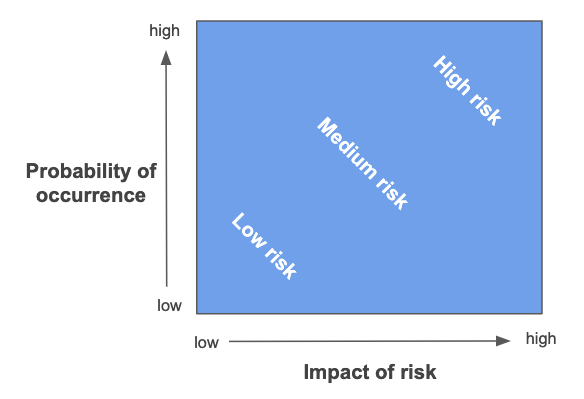
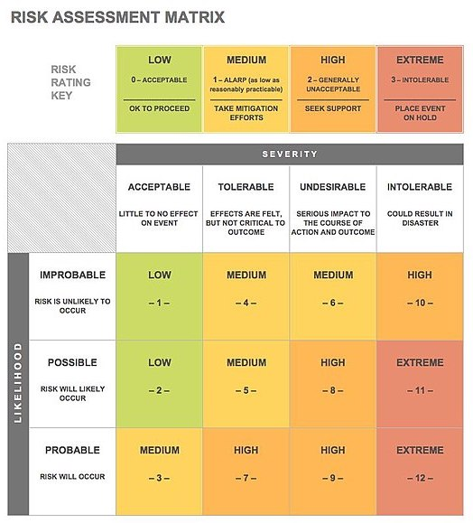

.. _Risk-Assessment: 

Risk Assessment
===============
At the time of evaluation, the risks identified should be ranked by their likelihood and impact. The likelihood refers to the probability of risks actually happening, while impact is a score based on the most likely scenario and its ramifications after a potential risk happens. 

The figure below illustrates the conceptual relationship between likelihood, impact and risk.

Once the risks are assessed based on their likelihood and impact score, they can be visualised on a risk matrix. The likelihood and impact categories can use other terms to reflect more subtly in the assessment.

The following is an example risk matrix from the `Wikimedia Commons <https://commons.wikimedia.org/wiki/File:IC-Risk-Assessment-Matrix-Template.jpg>`_. The image is available under the CC-BY-SA 4.0 license).

The event team can then decide which part of the matrix is above or below the project risk threshold. The risk threshold can be set according to the experience of the team or the degree of change in the type of event compared to others. New, complex and larger scale events will probably call for a lower risk threshold. The risks above the threshold will be considered as mitigated risks. 

See `the risk management template  <https://zenodo.org/record/4088024>`_ for an example that includes a risk matrix.

