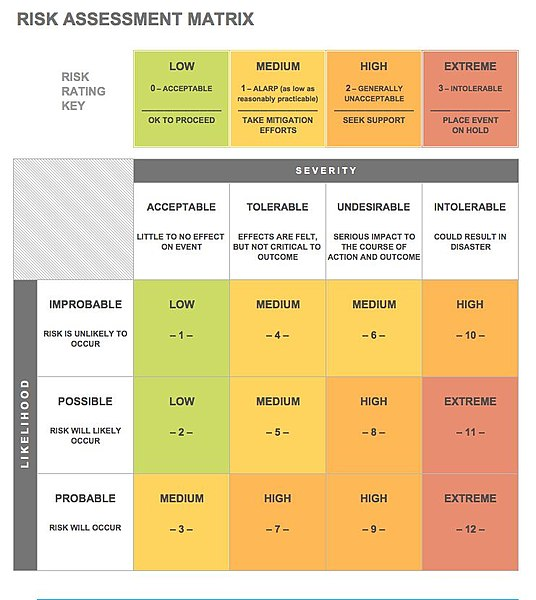

.. _Risk-Management:

Risk Management
===============

Risks are events that could have a negative impact on the project. Risk management (or risk analysis) is the process of
identifying and assessing a potential risk and the evaluation of the potential impact of the risk. Every risk assessment
should be followed by a risk mitigation plan - actions designed to eliminate or minimise the impact of the identified
risk.

Risk assessment
****************
Typically, risks are assessed against 2 criteria - the severity of the impact they have on your event and
probability of them happening. You then place the risks on the chart such as the one below, and classify them into
several categories, for example:

    * low risk - the risk is acceptable; it is OK to proceed with the event planning but keep an eye on the risk
    * medium risk - the risk needs to be addressed and mitigation strategy put in place
    * high risk - the risk is critical and may have an adverse effect on your event and stakeholders; you may even have to rethink if the event should go ahead

.. figure:: ../img/risk-assessment-graph.png
  :alt: Risk assessment chart

You can decide where to draw the boundaries between the risk categories on your risk chart. It is also OK to classify your risks into more
fine-grained categories, e.g. low, medium, high, extreme - based on your
individual risk assessment. For example, consider the following risk assessment matrix (obtained from `Wikipedia
Commons <https://commons.wikimedia.org/wiki/File:IC-Risk-Assessment-Matrix-Template.jpg>`_ under CC BY-SA 4.0 licence).

For events such as the CW or CC, we typically look at the following risk aspects:

    * The main stakeholder and funder (the Software Sustainability Institute)
    * Other stakeholders (sponsors, keynote speakers, attendees, session chairs, organising committee members, volunteers/helpers at the event)
    * Budget
    * Event agenda
    * Venue
    * Catering
    * Communication (with various stakeholders)
    * Policies, guidelines and documentation

When identifying risks, bear in mind that they happen at different times in the planning and implementation stages, as well as during and even after the event.

Here are some examples of risks identified when organising an event such as the CW or CC.

    * The main stakeholder
        - Event goals not aligned with the main stakeholder goals
        - Incidents during the event can damage the Institute's reputation
        - Loss of money
    * Sponsors
        - Not enough sponsorship
        - Offers made to sponsors that cannot be fulfilled
        - Sponsor's logo is not appropriately displayed, spelling and branding mistakes occur
    * Keynote speakers
        - Delay in confirmation or dropping out
        - Speakers goes off track in their talk or uses offensive language
    * Attendees
        - Not enough attendees or many dropping out right before the event
        - Too many participants
        - Participants complain about a certain aspect of the event
    * Session chairs
        - Not enough people to chair session
        - Session lead fails to show up or unclear on how to chair the session;
    * Organising committee members
        - Not kept up to date with the progress of event planning
        - Not sure how to contribute or how to share information and coordinate between different organising committee teams
        - No appropriate access to documentation
        - Not completing tasks assigned to them
        - At the event organising committee members do not know where help is needed and what their duties are at the event
        - Staff feel unappreciated or excluded;
    * Volunteers/helpers at the event
        - Not enough volunteers
        - Volunteers not showing up or not fulfilling the tasks assigned to them
        - Volunteers feel unappreciated
    * Budget
        - Insufficient budget (e.g. registration fees not appropriate)
        - Unexpected expenses (e.g. extra catering, damage to the venue)
        - Overspending
    * Event agenda
        - Not designing an effective agenda to meet the event's goals
        - Speakers dropping out at the last minute
        - Not fulfilling certain plans (e.g. social activities, venue for conference dinner, etc.)
        - Unexpected bad weather so cannot e.g. take group photo or do social activities outdoors
        - Post-event feedback highlights missed opportunities
    * Venue
        - Not finding the best venue for the specific date
        - Venue cancels before the event
        - Problems at the venue (accessibility, AV, etc.), fire tests, real fire alarm, venue needs to be evacuated
    * Catering
        - Not finding specific catering for the specific date
        - Catering cancels before the event
        - Lack of certain food of preference, wrong food delivered, missing food items, food not properly labelled for allergens and dietary requirements
    * Communication
        - Lack of transparent, efficient and effective communication with different stakeholders, e.g. not communicating clearly aims, expectations, planning decisions, task delegation
        - Participants confused about the agenda or not getting information on the right channels
        - During the event - signage not properly placed, people do not know who to contact to address certain queries or concerns
        - Participants do not receive information about what to expect after the event
    * Policies, guidelines and documentation
        - Lack of information or information dispersed at various locations
        - Lack of clearly stated policies and guidelines (e.g. Code of Conduct policy and breach reporting and handling procedures, privacy policy, contribution guide)
        - Certain documentation gets lost or corrupted

See `a more detailed example of risk assessment
<https://docs.google.com/spreadsheets/d/1hjlNIL-UbWus8O9raq1OtdvM2v1GECxjOeSegS6rIRM/edit?usp=sharing>`_ along with risk rating.

Risk mitigation
********************

Based on each individual risk identified during the risk assessment - you need to put a strategy in place to prepare for and lessen the effects of risks if they occur. It is OK to say that you will not take any action on an identified risk, as long as you have taken it into account and assessed. Bellow are some mitigating strategies for risks identified for CW and CC events.

    * The main stakeholder
        - Make sure that the main stakeholder's and event goals are clear and get a sign-off for the event plan from the main stakeholder
        - Think about the worst case scenario, consult with the legal and communication teams how such incidents could be handled, have a security policy in place that is clearly communicated with everyone
        - Make sure that the budget is carefully monitored throughout the event planning and implementation stage
    * Sponsors
        - Put sponsorship committee into place to look for sponsorship and focus on those that share your values
        - Have a range of sponsorship opportunities and levels and clearly communicate them to potential sponsors
        - Make sure it is clear what the sponsorship money can be used for, e.g. whether it is intended for a specific purpose, such as travel grants, dinner sponsorship, coffee break sponsorship, etc. and that it is used as agreed
    * Speakers
        - Make sure that the speaker's needs are discussed ahead of the event and state clearly what is possible and what is not
        - Communicate Code of Conduct clearly before and at the event
        - Have back-up speakers on stand-by
        - Have time-keeper or session chair signal the time to the speaker
    * Attendees
        - Define ticket prices based on the expected number of participants and make sure the tickets can cover the basic costs of venue and catering
        - Offer discounted tickets for certain categories, e.g. students or self-funded participants
        - Block registrations after certain number is reached to avoid too many attendees you cannot handle or talk to the venue about increasing capacity
        - Communicate Code of Conduct clearly before and at the event to set the expectations
    * Session chairs
        - Have organising committee members as back up to step in if session chairs do not show up
        - Make sure that chairing rules are communicated ahead of the event, talk to your chairs in person if possible before the session and use your organising committee members as back up
    * Organising committee members
        - Define different roles and let people choose what they want to do, communicate clearly what is expected from each role
        - Devise a duties rota for the event where everyone is assigned tasks and communicate it ahead of the event
        - Thank your organising committee members in person, make sure they are made known to the audience and feel appreciated; send them 'a 'thank you' note after the event and consider a small gift if possible
    * Volunteers/helpers at the event
        - Plan ahead and recruit more local people if needed
        - Communicate expectations clearly and make a duty rota for the event to make sure everyone know what they are doing
        - If budget allows, have special t-shirts for the helpers; thank them in person, make sure they are made known to the audience and feel appreciated; send them 'a 'thank you' note after the event
    * Budget
        - Go for a cheaper venue (get at least 3 quotes); only pay for absolutely necessary things (rooms and catering) and cut all extra and non-essential costs (they can be added if you attract sponsorship)
        - Look for more sponsorship
        - Evaluate ticket prices (the registration revenue should roughly cover venue and catering costs)
        - Have a contingency fund
        - Overspending should be avoided by careful budgeting before the event and keeping an eye on all costs and with contingency fund
    * Event agenda
        - Communicate with the organising committee ahead of the event to make sure that the agenda satisfies your criteria and all potential opportunities are explored
        - Have back-up speakers ready to step in at a short notice if possible
        - Make alternative plans for activities that depend on weather (e.g. schedule a second indoor location for group photo)
        - If post-event feedback highlights something that was missed, make note of this information as "lessons learned" to pass them on the future events organisers (or future self)
    * Venue
        - Look at several venues, see if dates can be changed, put insurance in place for venue cancellation
        - Visit venue ahead and check accessibility, AV equipment, availability of technical support, check fire alarm schedule
    * Catering
        - Look at several caterers and make sure there are alternatives; put insurance in place for cancellations
        - Ahead of the event, communicate clearly to the caterers attendee's dietary requirements; early on you can discuss potential/expected dietary requirements and check if the caterers can fulfill them all (e.g. gluten-free, vegan, vegetarian, halal, kosher);request all food to be labelled
        - To avoid cases where not enough food is available - discuss portion sizes and quantities with the caterers ahead of the event and consider ordering 10% more or increase quantities for the following day
    * Communication
        - Asses and prioritise stakeholders (based on their power and interest in your event) to know how to communicate with each of them
        - Make communication and publicity plans and choose what communications channels you are going to use based on your audience (e.g. news items, emails, blogs, twitter, slack, etc.)  
        - Define privacy policy for handling people's sensitive data and stick to it for any communication with people who registered to attend your event
        - Communicate the agenda clearly on various channels and in a timely manner
        - Assign roles to organising committee for communication on different issues during the event (Code of Conduct committee, first point of contact, etc.) and make those roles clear to participants before and at the event
        - Discuss placing signage with venue
        - Communicate any follow-ups with participants according to your privacy policy
    * Policies, guidelines and documentation
        - Document the processes, policies and guidelines and make notes of meeting minutes
        - Make sure everyone knows where documentation is kept and have the correct access rights
        - If any materials are made available ahead of the event, e.g. speakers presentations, slides, abstracts and talks - make sure they are communicated to the audience in a timely manner
        - Use cloud infrastructures for storing documents (such as Google docs, GitHub), where document history is preserved and documents are backed up automatically

An `example detailed risk mitigation plan
<https://docs.google.com/spreadsheets/d/1hjlNIL-UbWus8O9raq1OtdvM2v1GECxjOeSegS6rIRM/edit?folder=13SO7xkKx8UdxWG_3Fj-AKzxkrdQT5xDj#gid=254036893>`_
for each identified risk from the above `example risk assessment
<https://docs.google.com/spreadsheets/d/1hjlNIL-UbWus8O9raq1OtdvM2v1GECxjOeSegS6rIRM/edit?usp=sharing>`_ is available online.